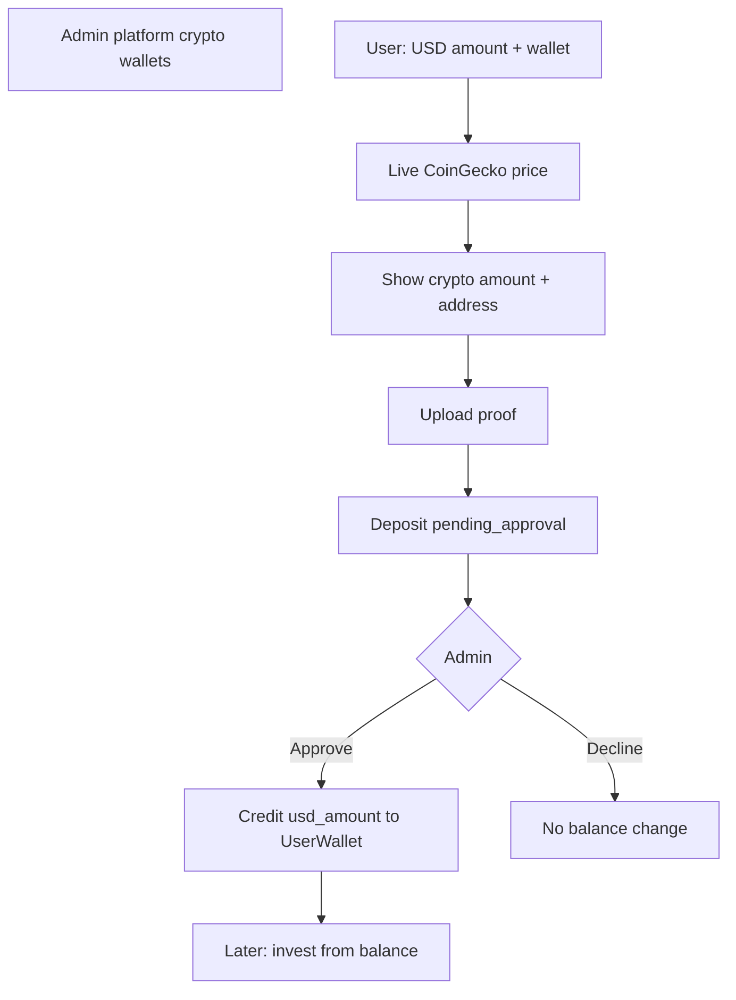

# User wallet funding (plan)

Status: **implemented via API contract** — see [user-wallet-funding-api-contract.md](./user-wallet-funding-api-contract.md)  
Audience: engineering / product / FE  
Last updated: 2026-08-04  

**UI sources**

- NovaCoin Fund Account (Phase A): balance + amount + wallet select + proof  
- Reference flow (NovaCoinsHoldings): USD amount → pick crypto → live convert → pay crypto to address → timer → upload proof → admin verify  

Related: [investment-packages-api-contract.md](./investment-packages-api-contract.md), [investment-platform.md](./investment-platform.md).

---

## Locked product decisions

| Topic | Decision |
|-------|----------|
| Amount user enters | **USD** (e.g. `$1000`) |
| Payment method | Crypto wallet **admin has set up** and marked available for funding |
| What user must send | **Crypto quantity** = `usd_amount / live_usd_price` (e.g. ~0.0157 BTC for $1000) |
| Conversion rate | **Live free API** — default **CoinGecko** `GET /api/v3/simple/price` (no paid key required for low volume; Demo key optional later for higher limits) |
| On admin approve | Credit **the USD amount** (e.g. **$1000**) to `UserWallet.available_balance` — **not** a re-priced crypto→USD at approve time |
| Admin verification | Manual, from **payment proof screenshot** |
| Balance before approve | Unchanged (still pending) |

---

## Member fund flow (happy path)

```text
1. User enters USD amount (1000) + selects payment method (e.g. Bitcoin wallet admin configured)
2. Backend (or quote endpoint) fetches live USD price for that asset → crypto_amount = 1000 / price
3. UI shows: send X BTC to ADDRESS (network) — optional payment window / timer (reference uses ~5:00)
4. User pays off-platform, uploads proof, confirms deposit
5. Deposit stored: pending_approval
     - usd_amount = 1000
     - crypto_amount_expected = X
     - conversion_rate_usd_per_unit = price used
     - platform_crypto_wallet_id + address snapshot
     - proof_image_path
6. Admin reviews screenshot → Approve or Decline
7. Approve → ledger credit + available_balance += 1000 (USD)
8. User header / Fund Account shows Balance $1000.00
```



---

## Domain pieces

### Platform crypto wallet (admin)

| Field | Notes |
|-------|--------|
| `name` | Label in dropdown (Bitcoin, USDT Eth network, …) |
| `asset_symbol` | BTC, ETH, USDT, XRP, … |
| `coingecko_asset_id` | Maps to CoinGecko id (`bitcoin`, `ethereum`, `tether`, `ripple`) for live price |
| `network_name` | Bitcoin, ERC20, TRC20, … |
| `wallet_address` | Receive address shown to user |
| `is_available_for_funding` | User-visible when true |
| `sort_order` | Dropdown order |
| `notes` | Admin-only optional |

### User wallet

- One per user; `available_balance` in **USD**; ledger-only mutations.

### Wallet deposit

| Field | Notes |
|-------|--------|
| `usd_amount` | What user requested; **what gets credited on approve** |
| `crypto_amount_expected` | Amount they were told to send (from live rate at quote/lock time) |
| `conversion_rate_usd_per_unit` | USD price of 1 unit of asset when quote locked |
| `quoted_at` / optional `quote_expires_at` | Support payment window (reference ~5 min) |
| `platform_crypto_wallet_id` | FK + snapshots of address/network/asset |
| `proof_image_path` | Required screenshot |
| `status` | `pending_approval` \| `approved` \| `declined` |
| Review audit fields | admin id, timestamps, decline reason |

### Ledger

On approve: `deposit_credit` for **`usd_amount`**, `balance_after`, link `wallet_deposit_id`.

---

## Live rate (CoinGecko — free)

- Endpoint: `https://api.coingecko.com/api/v3/simple/price?ids={coingecko_asset_id}&vs_currencies=usd`
- Map each admin wallet’s `coingecko_asset_id` (not only symbol — USDT ≠ ambiguous)
- **Cache** prices briefly (e.g. 30–60s) to respect free-tier rate limits
- **Lock rate on deposit create** (or when “awaiting payment” starts) so the crypto amount on the instruction screen stays stable for the payment window
- Admin approve credits **locked `usd_amount`**, even if market moved

Env (optional later): `COINGECKO_API_KEY` for Demo/Pro; keyless works for low volume.

---

## API sketch (contract next)

**Admin**

- CRUD `/admin/platform-crypto-wallets`
- List/review `/admin/wallet-deposits`
- `POST …/approve` → credit `usd_amount`
- `POST …/decline`

**User**

- `GET /wallet`
- `GET /platform-crypto-wallets` (available only; includes address + network)
- `GET /wallet/deposit-quote?usd_amount=&platform_crypto_wallet_id=` → `{ crypto_amount, rate, expires_at }`
- `POST /wallet/deposits` (multipart: usd_amount, wallet id, proof; or create pending then attach proof — match FE steps)
- `GET /wallet/deposits` (own records)

**Later:** invest from balance.

---

## Still open (small)

| # | Topic | Default |
|---|--------|---------|
| 1 | Payment window length | **5 minutes** (match reference); quote expires → user must re-quote |
| 2 | Can admin override USD on approve? | **No** by default — credit submitted `usd_amount`; decline if proof doesn’t match |
| 3 | Proof before or after “awaiting payment”? | Two-step OK: create awaiting deposit → upload proof (reference); NovaCoin Phase A may combine — support create-with-proof for simpler FE |
| 4 | Funding vs invest | **Funding first**, then invest pass |

---

## Implementation order

1. Admin platform crypto wallets CRUD (+ `coingecko_asset_id`)
2. CoinGecko quote service + cache + deposit-quote endpoint
3. UserWallet + ledger
4. Member deposit + proof + pending
5. Admin approve/decline → credit USD
6. Write FE contract `docs/user-wallet-funding-api-contract.md`
7. Invest-from-balance pass

Agents do not run migrations.
